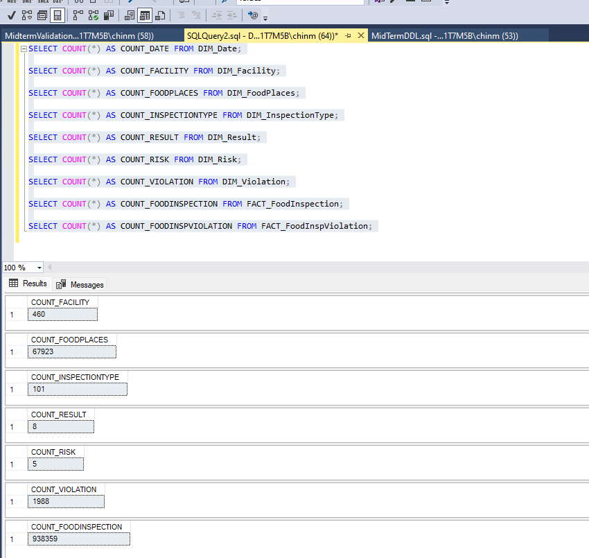

# 🍽️ Food Inspections Data Warehouse – Dallas & Chicago

A end-to-end data warehousing and analytics project analyzing food inspection results across Dallas, TX and Chicago, IL. Built using SQL, Python, Talend ETL, and Tableau to identify inspection trends, failure patterns, and risk factors across thousands of food establishments.

---

## 📌 Business Questions Answered

- Which food establishment types have the highest inspection failure rates?
- How do inspection pass/fail trends compare between Dallas and Chicago over time?
- What are the most common violation categories driving failures?
- Which geographic areas (zip codes / wards) have the highest concentration of violations?
- How effective are re-inspections in bringing failing establishments into compliance?

---

## 🛠️ Tech Stack

| Tool | Purpose |
|---|---|
| SQL (DDL + DML) | Schema design, data modeling, validation |
| Python (Pandas) | Data profiling, cleaning, EDA |
| Talend | ETL pipeline — extract, transform, load |
| Tableau | Interactive dashboard and visual analytics |
| Power BI | Executive KPI reporting |
| ER/Studio | Dimensional data model design |

---

## 🗂️ Project Architecture

```
Raw Data (Dallas + Chicago CSVs)
        ↓
Python Data Profiling (EDA + Cleaning)
        ↓
Talend ETL Jobs (Transform + Load)
        ↓
SQL Data Warehouse (Star Schema)
        ↓
Tableau / Power BI Dashboard
```

---

## 📁 Repository Structure

```
├── DDL.sql                        # Table creation scripts (star schema)
├── ValidationSQL.sql              # Data quality and validation checks
├── Table_Count.sql                # Row count verification across tables
├── DimensionalModel.pdf           # Star schema ER diagram
├── Tableau.twb                    # Tableau workbook
├── Report_Sarvesh.pdf             # Full project report
├── Table_Counts.png               # Data validation screenshot
├── Dallas Statistics y-data/
│   ├── Dallas_Data_Profiling.ipynb
│   └── Dallas_report.docx
├── Chicago Statistics y-data/
│   ├── Chicago_Data_Profiling.ipynb
│   └── Chicago_report.docx
└── TalendJobs/                    # ETL pipeline jobs
```

---

## 📊 Dashboard Preview

> Tableau dashboard covering inspection pass/fail rates, violation trends, and geographic risk analysis across Dallas and Chicago.
> 
> 📎 *Power BI file available upon request — file size exceeds GitHub limit.*

<!-- Add a screenshot here: drag a dashboard image into this README on GitHub -->


---

## 🔍 Key Findings

- Warehoused **67,923 food establishment records** across Dallas and Chicago into a star schema with 2 fact tables and 7 dimension tables
- Identified **101 distinct inspection types** and **8 result classifications**, enabling granular pass/fail trend analysis across both cities
- Geographic clustering of violations was identified across specific zip codes and wards, supporting targeted inspection resource allocation
- Re-inspection compliance patterns differed significantly between Dallas and Chicago, surfacing operational differences in municipal food safety enforcement

---

## 📂 Data Sources

- **Chicago Food Inspections:** [Chicago Data Portal](https://data.cityofchicago.org/Health-Human-Services/Food-Inspections/4ijn-s7e5)
- **Dallas Food Inspections:** [Dallas OpenData](https://www.dallasopendata.com)

---

## 👤 Author

**Sarvesh Salvi**  
M.S. Information Systems, Northeastern University  
[LinkedIn](https://linkedin.com/in/sarvesh-salvi) · [GitHub](https://github.com/salvisa)
